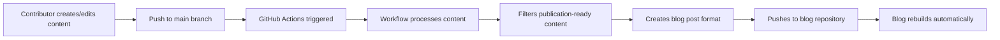

# Multilingual Journal Club - Architectural Plan

## Executive Summary

This document outlines the architectural plan for restructuring the **Multilingual Journal Club** repository and integrating it with **The Cnidae Gritty** Jekyll-based blog. The solution maintains clear separation of concerns while enabling seamless content sharing between repositories.

### Key Principles
1. **Separation of Concerns**: Keep language/communication content separate from web development
2. **Novice-Friendly**: Maintain simple workflows for content contributors
3. **Automated Integration**: Use GitHub Actions for seamless content synchronization
4. **Minimal Complexity**: Avoid introducing unnecessary technical barriers

---

## Current State Analysis

### Multilingual Journal Club Repository
- **Purpose**: Language learning and scientific communication practice
- **Content Structure**:
  ```
  prompts/
    └── {year}/
        └── {source_language}/
            └── {prompt_id}/
                ├── README.md (prompt and source material)
                └── {target_language}/
                    └── {author}_writing.md
  ```
- **Users**: Novice GitHub users, language learners, scientists
- **Focus**: Content creation, peer review, language practice

### The Cnidae Gritty Blog (Target Integration)
- **Purpose**: Public-facing Jekyll blog showcasing science communication
- **Technology**: Jekyll static site generator
- **Content Needs**: Curated writings from Multilingual Journal Club
- **Users**: Blog readers, web developers

---

## Proposed Architecture

### Option Analysis

#### Option 1: GitHub Actions (RECOMMENDED)
**Advantages:**
- No submodule complexity for novice users
- Automated, event-driven synchronization
- Clear separation - contributors don't interact with blog repo
- Flexible content transformation (filtering, formatting)
- Easy to maintain and update

**Disadvantages:**
- Requires GitHub Actions knowledge for maintainers
- Small delay between content creation and blog publication

#### Option 2: Git Submodules
**Advantages:**
- Direct repository linking
- Immediate content availability

**Disadvantages:**
- Adds complexity for novice contributors
- Requires understanding of submodule commands
- Manual synchronization required
- Can cause confusion with nested repositories

**Decision: Use GitHub Actions** - Better aligns with goal of maintaining novice-friendly workflow in content repository.

---

## Detailed Architecture: GitHub Actions Approach

### Repository Structure

#### Multilingual Journal Club Repository
```
multilingual_journal_club/
├── .github/
│   └── workflows/
│       └── sync-to-blog.yml          # Auto-sync content to blog
├── prompts/
│   └── {year}/{language}/{prompt}/
│       ├── README.md                  # Prompt description
│       └── {target_language}/         # Writings in target languages
│           └── *.md
├── 000_example/                       # Example submissions
├── ARCHITECTURE.md                    # This document
├── CONTRIBUTING.md                    # Contributor guidelines
├── README.md                          # Main documentation
└── topics.md                          # Topic index
```

**Changes Required:**
- Add `.github/workflows/sync-to-blog.yml` workflow
- Create `CONTRIBUTING.md` for clear contribution guidelines
- Update `README.md` with architectural overview

#### The Cnidae Gritty Repository (Blog)
```
the-cnidae-gritty/
├── .github/
│   └── workflows/
│       └── receive-content.yml        # Receive synced content
├── _posts/                            # Jekyll blog posts
├── _data/
│   └── journal_club/                  # Synced content from MJC
│       └── writings/
│           └── {curated_content}.md
├── _config.yml                        # Jekyll configuration
├── _layouts/
│   └── journal_club_post.html         # Custom layout for MJC content
└── pages/
    └── journal-club.md                # Landing page for journal club content
```

**Changes Required:**
- Add workflow to receive content from Multilingual Journal Club
- Create Jekyll layout for journal club writings
- Add landing page to showcase journal club content

---

## Content Synchronization Workflow

### Automatic Sync Process



### Content Selection Criteria

The sync workflow will include logic to determine which content to publish:

1. **Publication Markers**: Files/folders marked with `_publish` or similar indicator
2. **Quality Gates**: Content reviewed and merged to main branch
3. **Metadata**: YAML frontmatter indicating publication readiness
4. **Curation**: Manually curated list in `_config.yml` or separate file

### Content Transformation

The GitHub Actions workflow will:
1. Copy content from Multilingual Journal Club
2. Transform markdown to include Jekyll frontmatter
3. Add metadata (author, language, date, topic)
4. Organize by categories/tags for blog navigation
5. Optionally: Generate bilingual post layouts

---

## Technical Implementation

### GitHub Actions Workflow (Multilingual Journal Club)

**File: `.github/workflows/sync-to-blog.yml`**

Key features:
- Triggers on push to main branch
- Scans for new/updated content
- Applies publication filters
- Transforms content to Jekyll format
- Commits to The Cnidae Gritty repository

**Authentication:**
- Uses GitHub Personal Access Token (PAT) or deploy key
- Stored as repository secret: `BLOG_SYNC_TOKEN`

### GitHub Actions Workflow (The Cnidae Gritty)

**File: `.github/workflows/receive-content.yml`**

Optional workflow to:
- Trigger Jekyll rebuild
- Validate received content
- Send notifications

---

## Contribution Workflows

### For Language Learners (Multilingual Journal Club)

**Simple Web Interface (Recommended for Novices):**
1. Browse to target folder on GitHub.com
2. Click "Add file" → "Create new file"
3. Write content in markdown
4. Click "Commit changes" (creates branch + pull request)
5. Request review from partner
6. Maintainer merges after review

**Alternative: GitHub Desktop or Git CLI** (for advanced users)

### For Blog Maintainers (The Cnidae Gritty)

1. Review auto-synced content in `_data/journal_club/`
2. Curate content for featured posts
3. Adjust Jekyll layouts/templates as needed
4. Manage blog-specific features (comments, analytics, etc.)

---

## Migration and Setup Steps

### Phase 1: Documentation and Planning (This Phase)
- [x] Create architectural plan document
- [ ] Review and approve plan with stakeholders
- [ ] Identify blog repository location/access

### Phase 2: Multilingual Journal Club Setup
- [ ] Create `.github/workflows/sync-to-blog.yml`
- [ ] Create `CONTRIBUTING.md` with clear guidelines
- [ ] Update `README.md` with architectural overview
- [ ] Set up repository secrets for authentication
- [ ] Test workflow with example content

### Phase 3: The Cnidae Gritty Integration
- [ ] Create `_data/journal_club/` directory structure
- [ ] Create Jekyll layout for journal club content
- [ ] Add landing page for journal club section
- [ ] Configure GitHub Actions to receive content
- [ ] Test end-to-end synchronization

### Phase 4: Documentation and Launch
- [ ] Create user guide for contributors
- [ ] Update READMEs in both repositories
- [ ] Create video/tutorial for novice users
- [ ] Announce changes to community
- [ ] Monitor and iterate based on feedback

---

## Content Discovery and Navigation

### In Multilingual Journal Club
- Maintain `topics.md` index
- Add search functionality via GitHub's built-in search
- Use clear folder structure and README files

### In The Cnidae Gritty Blog
- Landing page: `/journal-club/`
- Filter by:
  - Target language
  - Source language
  - Topic/subject area
  - Author
  - Date
- RSS feed for journal club posts
- Tags/categories for Jekyll organization

---

## Security and Access Control

### Multilingual Journal Club
- Branch protection on `main` branch
- Require pull request reviews
- Maintain contributor access list
- Use GitHub Issues/Discussions for questions

### The Cnidae Gritty
- Separate repository with own access controls
- Blog maintainers have write access
- Content synced via GitHub Actions (no contributor access needed)
- Deploy key with write access to blog repo

---

## Rollback and Disaster Recovery

### Content Recovery
- All content versioned in Git history
- Easy rollback via Git commands
- GitHub maintains backup of all repositories

### Workflow Failures
- GitHub Actions provides logs for debugging
- Manual sync possible as backup
- Notifications on workflow failures

---

## Benefits of This Architecture

### For Novice Contributors
✅ No need to understand blog technology
✅ Simple GitHub web interface for contributions
✅ Focus on content, not technical setup
✅ Clear, beginner-friendly instructions

### For Blog Maintainers
✅ Full control over blog design and features
✅ Automated content ingestion
✅ No content contributors in blog repository
✅ Flexibility to transform/curate content

### For the Community
✅ Clear separation of concerns
✅ Public showcase of language practice
✅ Discoverable content on both platforms
✅ Scalable as community grows

---

## Alternative Approaches (For Reference)

### Manual Sync
- Content manually copied between repositories
- Simple but error-prone and time-consuming
- Not recommended for active community

### Monorepo Approach
- Single repository with blog and content
- Simpler but mixes concerns
- Exposes novices to web development complexity
- Not recommended per requirements

### API-Based Integration
- Custom API to serve content
- Complex and over-engineered for this use case
- Not recommended for static blog

---

## Success Metrics

### Technical Metrics
- Sync latency: < 5 minutes from commit to blog update
- Workflow success rate: > 95%
- Zero manual intervention required for routine syncs

### Community Metrics
- Increased contributor participation
- Reduced confusion/support requests
- Positive feedback on workflow simplicity
- Growth in published content

---

## Maintenance and Support

### Responsibilities

**Multilingual Journal Club Repository:**
- Content review and approval
- Community management
- Sync workflow maintenance
- Contributor support

**The Cnidae Gritty Blog:**
- Blog design and features
- Content curation and presentation
- Jekyll configuration
- Web hosting and performance

### Support Channels
- GitHub Issues: Technical problems
- GitHub Discussions: Questions and ideas
- Email: Direct contact with Dr. McMinds

---

## Future Enhancements

### Potential Improvements
1. **Automated Quality Checks**: Grammar/spell check in workflows
2. **Multi-language Search**: Enhanced search across languages
3. **Interactive Features**: Comments, reactions on blog
4. **Analytics**: Track popular topics and languages
5. **Mobile App**: Companion app for easier contributions
6. **API Layer**: Expose content via REST API
7. **Automated Translations**: AI-assisted translation suggestions
8. **Rich Media**: Support for audio/video content

---

## Conclusion

This architecture provides a robust, scalable solution that:
- Maintains simplicity for novice contributors
- Enables professional blog presentation
- Automates content synchronization
- Preserves clear separation of concerns
- Scales with community growth

The GitHub Actions approach is recommended as it best balances automation, simplicity, and maintainability while keeping the Multilingual Journal Club repository focused on its core mission of language learning and scientific communication.

---

## Appendix: Quick Reference

### For New Contributors
1. Find a prompt in `prompts/{year}/{language}/`
2. Navigate to target language folder (or create one)
3. Click "Add file" → "Create new file"
4. Write your summary/analysis
5. Commit and create pull request
6. Get feedback from community
7. Content auto-publishes to blog when merged!

### For Maintainers
- **Approve PRs**: Review content quality and merge
- **Manage Workflows**: Monitor GitHub Actions
- **Update Docs**: Keep CONTRIBUTING.md current
- **Community**: Respond to Issues/Discussions

### For Blog Developers
- **Content Location**: `_data/journal_club/` in blog repo
- **Layouts**: `_layouts/journal_club_post.html`
- **Configuration**: Check `.github/workflows/`
- **Troubleshooting**: GitHub Actions logs

---

*Document Version: 1.0*  
*Last Updated: 2026-02-14*  
*Author: Architectural Planning Team*
